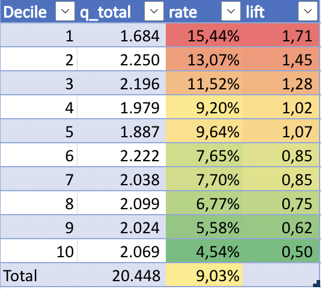

# Diabetes- Readmission
Problem Statement and Objective A hospital readmission is when a patient who is discharged from the hospital, gets re-admitted again within a certain period of time. Hospital readmission rates for certain conditions are now considered an indicator of hospital quality, and also affect the cost of care adversely. For this reason, Centers for Medicare & Medicaid Services established the Hospital Readmissions Reduction Program which aims to improve quality of care for patients and reduce health care spending by applying payment penalties to hospitals that have more than expected readmission rates for certain conditions. Although diabetes is not yet included in the penalty measures, the program is regularly adding new disease conditions to the list, now totaling 6 for FY2018. In 2011, American hospitals spent over $41 billion on diabetic patients who got readmitted within 30 days of discharge. Being able to determine factors that lead to higher readmission in such patients, and correspondingly being able to predict which patients will get readmitted can help hospitals save millions of dollars while improving quality of care. So, with that background in mind, we used a medical claims dataset (description below), to answer these questions:

1- What factors are the strongest predictors of hospital readmission in diabetic patients?
2- How well can we predict hospital readmission in this dataset with limited features?

## Repository Structure
- Data: This folder contains raw and processed data used as input for modeling.

- Notebooks: In this folder, there are two files. The `analisis_resultadoss.ipynb` file evaluates the prediction of the optimized LightGBM model and creates a KS table to determine how well the model discriminates by decile. It is in this summary table that profiles prone to making a readmission with a higher readmission rate than the entire base can be found. Also, we can find the **shap values** analysis which is related to model interpretabilty. The other file is `main.ipynb`, which performs data ingestion, exploratory data analysis (EDA), and variable transformations.

- entrenamiento.py: This file contains a pipeline for training a LightGBM model and optimizing it using Optuna. The trained model is saved, along with variable importance. The AUC of this model is 0.61.

- outputs: This folder contains several subfolders:

    - hyperparameter_tuning: Here, the combination of hyperparameters used in iterations for optimization is saved.

    - imp_variables: Variable importance is saved here.

    - ks: The table containing successes per decile is saved here.

    - models: The model is saved in a text file here.

    - preds: Predictions are saved here.

- prediction.py: This file is used to run the model in production.

- eval_results.xlsx: This file is used to evaluate model results and we can find the following:

What we can use to explain the business, what can do with the model: find some patients which are has higher propensity to pass readmission

- metrics.py: This file contains the metrics used for measuring the LightGBM model during its optimization.

- requirements.txt: This file contains the libraries used in the project.

## Results
One model were evaluated: LightGBM. The ranking of models, from highest to lowest AUC, was as follows:

1. Optimized LightGBM  (AUC: 0.61)

  AUC was chosen as the metric because it indicates whether the model discriminates between positives and negatives, and it uses probability to identify propensities and prioritize profiles according to the model.

## Model Comparison by AUC

| Model | AUC |
|--------|-----|
| Optimized LightGBM | 0.61 |

It should be noted that the LightGBM model optimized by Optuna was trained using a pipeline and saved in the `models` folder within the `outputs` folder. Additionally, the importance of variables used in this model was saved in the `imp_variables` subfolder within the same folder.

If you wish to reproduce the results, make sure you have installed the libraries listed in `requirements.txt`. Then, you can run the `entrenamiento.py` and `prediction.py` files to train the optimized LightGBM model and make predictions in production, respectively.

## Next Steps
- Change the category treatment method: Mean encoding or frequency encoding can be used.
- Add more variables: Additional variables such as interaction variables, insurance queries, sales type, contact channels, payment type, etc., can be considered.
- Taking into account time in the variable transformations
- Outlier treatment.
- For model monitoring, consider:
    - AUC over time.
    - Sorting rates by deciles.
    - PSI and CSI to determine if the distribution of the target and independent variables changes over time.
- To test the model, it is recommended to work on a pilot project with a control group to assess whether model prioritization versus non-prioritization is better.
